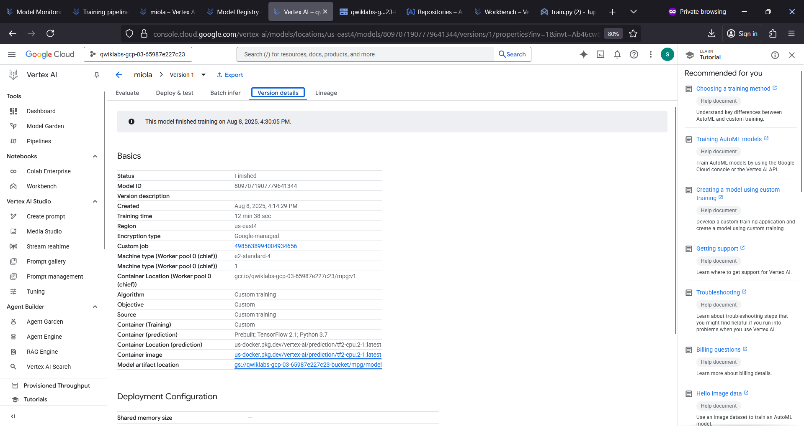

# miola
miola : Custom Model # Automotive # TensorFlow

## Objective
- Train a model in a custom container (any framework)
- Deploy a TensorFlow model using a pre-built container with same workflow used for training
- Create a model endpoint and generate a prediction

## Train & Deploy Custom Tensorflow Model

